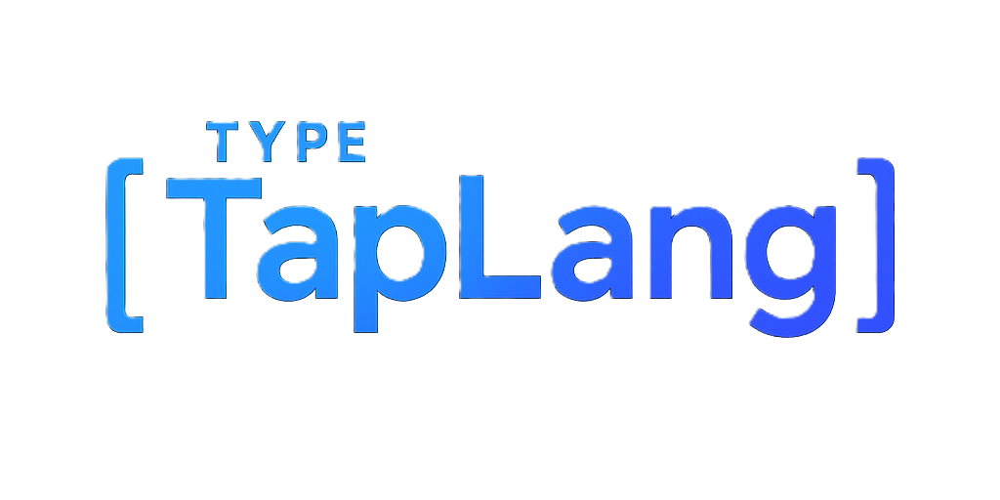

<p align="center">
  
</p>

# TapLang - Keyboard Action Language

**🤖 Primarily designed for AI agents and automation systems**

A simple, lightweight language for representing keyboard actions. Perfect for AI agents, web terminals, and cross-platform automation.


<div align="center">


</div>


## 🎯 Overview

TapLang allows you to describe keyboard interactions as simple text commands:

```taplang
TYPE[Hello World]
PRESS[CTRL] CLICK[C] RELEASE[CTRL]
SET_WAIT[RANDOM[100,500]] WAIT[] WAIT[] TYPE[Done]
```

## 📁 Project Structure

```
TapLang/
├── assets/                 # Logo and visual assets
├── LICENSE                 # Project license  
├── README.md              # This file
├── TapLang/               # Language specification & concept
│   ├── TapLang.json       # JSON specification (reference)
│   ├── SPECIFICATION.md   # Technical specification
│   └── CONCEPT.md         # Design philosophy & background
└── Python/                # Python implementation
    ├── TapLang/           # Python package
    │   ├── __init__.py    # Package exports
    │   ├── data.py        # Specification data (authoritative)
    │   ├── parser.py      # Code parsing
    │   ├── validator.py   # Validation logic  
    │   └── interpreter.py # Execution engine
    ├── test.py           # Interactive test tool
    ├── examples.py       # Usage examples
    └── README.md         # Complete usage guide
```

## 🚀 Getting Started

TapLang makes keyboard automation simple and AI-friendly:

```taplang
TYPE[`Hello AI Agent`]              # Simple backticks!
PRESS[CTRL] CLICK[C] RELEASE[CTRL]  # Copy  
TYPE[`Dynamic: FORMAT[RANDOM[Alice,Bob,Charlie]]`]  # Random content
SET_WAIT[RANDOM[100,500]] WAIT[]   # Random timing
```

👉 **For detailed usage and examples**, see the [Python Implementation](Python/README.md)

## � Documentation

- **[Python Usage Guide](Python/README.md)** - Complete implementation and examples
- **[Language Specification](TapLang/SPECIFICATION.md)** - Technical specification
- **[Original Concept](TapLang/CONCEPT.md)** - Design philosophy and background

## 🎯 Use Cases

### 🤖 **AI Agent / Web Terminal Integration** ⭐
**Primary Target: AI Systems**
- **Keyboard as AI Input Layer**: Bridge between physical keyboard and AI agents
- **Web Terminal Sync**: Real-time key sequences transmitted to web terminals
- **Enhanced Automation**: AI reacts to sequences, suggests completions, executes workflows
- **Remote Control**: Multiple devices share same keyboard language for AI control

### Automation / Macro Systems
- Custom shortcuts mapped to complex commands
- Text expansion for code snippets and repetitive inputs
- Game macros and multi-key combinations

### Assistive Technology
- Convert limited input devices into rich commands
- Alternative input methods for accessibility
- Single switches and pedals triggering action sequences

### Custom Human-Computer Interaction
- Gesture keyboards with simultaneous key presses
- Music/performance tools triggering notes and effects
- Experimental interfaces for robots, drones, visualizations

### Security / Steganography
- Encoded input with encrypted commands
- Hidden commands through specific sequences
- Secret function activation

### Learning / Training Tools
- Typing tutors with sequence tracking
- Morse code-style input practice
- Personalized training exercises

### Communication / Scripting
- Domain-specific language for structured commands
- Remote IoT device control over networks
- Cross-platform consistency across systems

## ✨ Key Features

- **🤖 AI-First Design** - Built specifically for AI agents and automation
- **🚧 Concept Barriers** - Super simple text handling with `TYPE[`text`]` syntax and `FORMAT[RANDOM[]]` support
- **🌍 Cross-Platform** - Works consistently across operating systems  
- **⚡ Smart Validation** - Catches errors like unfinished press operations and invalid keys
- **🎲 Dynamic Timing** - Fixed delays or human-like random timing
- **📝 Simple Syntax** - Easy to read, write, and parse

## 📜 License

See [LICENSE](LICENSE) file for details.

## 📦 **Distribution & Implementation**

### 🚀 **Planned Releases**
**We're looking for contributors to help implement TapLang across platforms:**

- **🐍 Python PyPI Package** - *Coming soon to pip install*
- **⚡ C/C++ Implementation** - *High-performance native library*
- **🌐 Web/JavaScript** - *Browser and Node.js support*

**Volunteers welcome!** Help us bring TapLang to more platforms and programming languages.

## 🤝 Contributing

1. Check the specification in `TapLang/SPECIFICATION.md`
2. Follow the existing code style (simple, functional)
3. Add tests for new features
4. Update documentation

## 🌟 Part of CTF-ORION Project

TapLang concept originated from the **CTF-ORION** project:
- 🌐 Website: [ctforion.com](https://ctforion.com)
- 📁 GitHub: [github.com/ctforion](https://github.com/ctforion)

---

**TapLang**: Making keyboard actions simple, portable, and AI-ready.